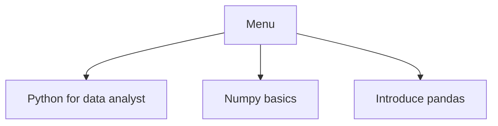

# Data Analysis Introduce

## Python

## Contents

- [Chapter 2](./chapter-2_examples_using_python_for_data_analysis.ipynb): Examples using python for data analysis
- [Chapter 4](./chapter-4_numpy_basics_array_n_vector.ipynb): Numpy basics Array and Vector

